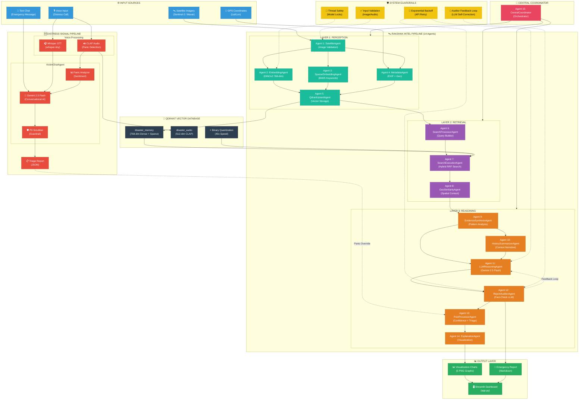

# Project Rakshak: Complete System Architecture

> **15-Agent Multi-Modal Disaster Response Pipeline**  
> Built with Qdrant, Gemini 2.5 Flash, DINOv2, Whisper, CLAP  
> Made by Shaunak Majumdar and Arnav Chauhan, IIT Kharagpur

---

## Table of Contents
1. [System Overview](#system-overview)
2. [Agent-by-Agent Breakdown](#agent-by-agent-breakdown)
3. [Data Flow Explanation](#data-flow-explanation)
4. [Feedback Loops & Guardrails](#feedback-loops--guardrails)
5. [Complete Mermaid Diagram](#complete-mermaid-diagram)

---

## System Overview

Project Rakshak consists of **two parallel pipelines** that can operate independently or together:

| Pipeline | Purpose | Entry Point | Output |
|----------|---------|-------------|--------|
| **Distress Signal Pipeline** | Real-time emergency chat with victims | Voice/Text input from `app.py` | Triage JSON with priority |
| **Rakshak Intel Pipeline** | Satellite imagery analysis | Image + GPS from `main.py` | Emergency Report + Visualizations |

Both pipelines share:
- **Qdrant Vector Database** (disaster_memory, disaster_audio collections)
- **Gemini 2.5 Flash LLM** (for reasoning and chat)
- **Common Guardrails** (PII scrubbing, retry logic, input validation)

---

## Agent-by-Agent Breakdown

### DISTRESS SIGNAL PIPELINE (Chat Mode)

```
┌─────────────────────────────────────────────────────────────────┐
│                    DISTRESS SIGNAL PIPELINE                     │
│   Entry: Voice/Text Input → Exit: Triage Report                 │
└─────────────────────────────────────────────────────────────────┘
```

#### Step D1: Voice Input Processing
**File:** `utils/voice_input.py`

| Component | Technology | Function |
|-----------|------------|----------|
| **Whisper STT** | `openai/whisper-tiny` | Converts audio → text transcript |
| **CLAP Audio** | `laion/clap-htsat-unfused` | Generates 512-dim audio embeddings for panic detection |

**Data Flow:**
```
Audio (WAV) → Whisper → Transcript (Text)
           ↘ CLAP → Audio Embedding (512-dim) → Panic Score
```

#### Step D2: VictimChatAgent
**File:** `layers/reasoning/victim_chat.py`

| Component | Technology | Function |
|-----------|------------|----------|
| **Chat LLM** | `Gemini 2.5 Flash` | Multi-turn conversational AI with emergency context |
| **PII Scrubber** | Regex patterns | Removes names, phone numbers, addresses before LLM |
| **Panic Analyzer** | Rule-based + CLAP | Detects urgency from voice tremor/keywords |

**Internal Loop (Multi-turn Conversation):**
```
User Message → PII Scrubber → Gemini LLM → Response
     ↑                                         │
     └─────────── Continue Chat ───────────────┘
```

**Session Analysis Flow:**
```
Chat History → analyze_session() → Triage JSON {
    "priority": "HIGH",
    "resources_needed": ["Ambulance", "Fire"],
    "eta": "15 minutes",
    "key_details": {...}
}
```

#### Step D3: Triage Override Connection
**Connection to Main Pipeline:**
```
Triage JSON ─────────────→ PostProcessorAgent (Panic Boost)
             "priority"       Increases resource allocation
```

---

### RAKSHAK INTEL PIPELINE (14 Agents)

```
┌─────────────────────────────────────────────────────────────────┐
│                    RAKSHAK INTEL PIPELINE                        │
│   Entry: Satellite Image + GPS → Exit: Emergency Report         │
└─────────────────────────────────────────────────────────────────┘
```

#### LAYER 1: PERCEPTION (Agents 1-5)

##### Agent 1: SatelliteAgent
**File:** `layers/ingestion/satellite.py`

| Input | Process | Output |
|-------|---------|--------|
| Image path (PNG/JPG) | Validates format, resolution, file existence | PIL Image object |

**Guardrail:** Input Validation (rejects corrupted/invalid images)

```
image_path → validate_image() → PIL.Image
                ↓
           [REJECT if invalid]
```

##### Agent 2: EmbeddingAgent
**File:** `layers/ingestion/embedding.py`

| Input | Process | Output |
|-------|---------|--------|
| PIL Image | DINOv2 ViT-B/14 forward pass | 768-dim dense vector |

**Thread Safety:** Model loading protected by mutex lock

```
PIL.Image → Resize(224x224) → DINOv2 → Dense Vector [768-dim]
```

##### Agent 3: SparseEmbeddingAgent
**File:** `layers/ingestion/sparse_embedding.py`

| Input | Process | Output |
|-------|---------|--------|
| Metadata (disaster_type, location) | BM25 tokenization | Sparse vector (indices + values) |

```
"earthquake, Los Angeles, 34.05, -118.24" → BM25 → Sparse Vector
```

##### Agent 4: MetadataAgent
**File:** `layers/ingestion/metadata.py`

| Input | Process | Output |
|-------|---------|--------|
| Image path + GPS | Extracts EXIF, formats payload | Metadata dict |

```
{image_path, lat, lon, disaster_type} → metadata dict {
    "incident_id": "...",
    "location": {"lat": 34.05, "lon": -118.24},
    "disaster_type": "earthquake",
    "timestamp": "2024-01-22T..."
}
```

##### Agent 5: QdrantUpsertAgent
**File:** `layers/ingestion/qdrant_upsert.py`

| Input | Process | Output |
|-------|---------|--------|
| Dense + Sparse vectors, Metadata | Upsert to Qdrant | Point ID |

```
{dense_vector, sparse_vector, metadata} → Qdrant.upsert() → point_id
                                              ↓
                                    [disaster_memory collection]
```

---

#### LAYER 2: RETRIEVAL (Agents 6-8)

##### Agent 6: SearchProcessorAgent
**File:** `layers/search/search_processor.py`

| Input | Process | Output |
|-------|---------|--------|
| Query image + metadata | Builds hybrid search configuration | Search params |

**Merged Functionality:** Combines query building, filter construction, and ranking config

```
{disaster_type, location} → SearchParams {
    "dense_weight": 0.7,
    "sparse_weight": 0.3,
    "filters": {"disaster_type": ["earthquake", "flood"]},
    "limit": 10
}
```

##### Agent 7: SearchExecutionAgent
**File:** `layers/search/hybrid_search.py`

| Input | Process | Output |
|-------|---------|--------|
| Query vectors + SearchParams | Hybrid RRF Search on Qdrant | Ranked results |

**Key Feature:** Binary Quantization with 2x oversampling + rescore

```
Query Vectors → Qdrant.query_points() → RRF Fusion → Top-K Results
                     ↓                      ↓
              [Binary Quantization]    [Rescore with full vectors]
                  (40x faster)
```

##### Agent 8: GeoSimilarityAgent
**File:** `layers/reasoning/geo_search.py`

| Input | Process | Output |
|-------|---------|--------|
| GPS coordinates | Geo-filtered search within radius | Nearby incidents |

```
{lat, lon, radius_km} → Geo-Filter → Nearby Historical Incidents [
    {"id": "INC_001", "distance_km": 2.5, "damage": "major"},
    ...
]
```

---

#### LAYER 3: REASONING (Agents 9-14)

##### Agent 9: EvidenceSynthesisAgent
**File:** `layers/reasoning/recomm.py`

| Input | Process | Output |
|-------|---------|--------|
| Search results | Pattern extraction + aggregation | Patterns dict |

```
Search Results → Aggregate Damage Types → Patterns {
    "damage_counts": {"destroyed": 5, "major-damage": 8, ...},
    "severity_distribution": {"critical": 0.3, "high": 0.5, ...},
    "mode": "high",
    "geographic_center": [34.05, -118.24],
    "quality_score": 0.78
}
```

##### Agent 10: HistorySummarizerAgent
**File:** `layers/reasoning/history_summarizer.py`

| Input | Process | Output |
|-------|---------|--------|
| Nearby incidents | Narrative generation | Context paragraph |

```
Nearby Incidents → Generate Summary → "Historical context: This region 
experienced 3 major floods in the past decade. The 2020 disaster 
resulted in 50+ casualties..."
```

##### Agent 11: LLMReasoningAgent (CORE)
**File:** `layers/reasoning/llm_reasoning.py`

| Input | Process | Output |
|-------|---------|--------|
| Patterns + History + Metadata | Gemini 2.5 Flash prompt | Draft Report |

**Guardrail:** Exponential backoff retry (3 attempts, 2x delay)

```
{patterns, history_summary, metadata} → Prompt Template → Gemini API
                                            ↓
                                    Draft Report (Markdown)
```

##### Agent 12: ReportAuditorAgent (VERIFIER)
**File:** `layers/reasoning/evaluator.py`

| Input | Process | Output |
|-------|---------|--------|
| Draft Report + Metadata | Fact-checking LLM pass | Verified Report |

**FEEDBACK LOOP:** Auditor can request corrections from LLM

```
Draft Report → Auditor Prompt → Gemini API → {
    "verified": true/false,
    "corrections": [...],
    "final_report": "..."
}
        ↓
   [If corrections needed]
        ↓
   Re-submit to Agent 11 (LLMReasoningAgent)
```

##### Agent 13: PostProcessorAgent
**File:** `layers/reasoning/post_processor.py`

| Input | Process | Output |
|-------|---------|--------|
| Verified Report + Patterns + Triage Override | Confidence + Priority | Final metadata |

**Merged Agents:** Combines Confidence (11), Explanation (12), Priority (13)

```
{report, patterns, quality_metrics, triage_override} → 
    _calculate_confidence() → confidence_score (0.0-1.0)
    _recommend_priority() → triage {
        "priority_level": "critical",
        "response_time_hours": 1,
        "resource_allocation": {"personnel": 80, "vehicles": 20}
    }
```

**Triage Override (from Chatbot):**
```
If triage_override.panic_score == "High":
    priority_level += 1 tier (e.g., "high" → "critical")
```

##### Agent 14: ExplanationAgent (VISUALIZATION)
**File:** `layers/reasoning/explanation.py`

| Input | Process | Output |
|-------|---------|--------|
| Report + Patterns + Confidence | Matplotlib chart generation | PNG paths |

**Charts Generated:**
1. `*_damage_distribution.png` - Bar chart of damage types
2. `*_confidence_gauge.png` - Half-circle gauge
3. `*_severity_breakdown.png` - Pie chart
4. `*_risk_radar.png` - 5-axis spider chart
5. `*_resource_allocation.png` - Horizontal bar chart

```
{patterns, confidence} → Matplotlib → 5 PNG files in reports/visualizations/
```

---

#### ORCHESTRATOR

##### Agent 15: CentralCoordinator
**File:** `main.py`

| Role | Function |
|------|----------|
| **Orchestrator** | Sequences all 14 agents in correct order |
| **Error Handler** | Catches exceptions, returns structured error |
| **Parallel Execution** | Runs SearchExecution + GeoSimilarity in parallel threads |

```python
def process_new_incident(image_path, lat, lon, disaster_type, ...):
    # LAYER 1
    image = agents["satellite"].validate(image_path)
    dense = agents["embedder"].embed(image)
    sparse = agents["sparse_embedder"].embed(metadata)
    agents["upsert"].store(dense, sparse, metadata)
    
    # LAYER 2 (Parallel)
    with ThreadPoolExecutor:
        results = agents["searcher"].search(...)
        nearby = agents["geo_search"].find_nearby(...)
    
    # LAYER 3
    patterns = agents["synthesizer"].analyze(results)
    history = agents["history_summarizer"].summarize(nearby)
    draft = agents["llm"].generate_report(patterns, history)
    verified = agents["auditor"].audit(draft)  # ← FEEDBACK LOOP
    final = agents["post_processor"].process(verified, patterns)
    charts = agents["explanation"].generate(final)
    
    return {report, charts, confidence, triage}
```

---

## Data Flow Explanation

### Complete Pipeline Flow (Numbered Steps)

```
[1] Input: Satellite Image + GPS Coordinates
        ↓
[2] SatelliteAgent validates image format
        ↓
[3] PARALLEL:
    ├─→ EmbeddingAgent → 768-dim dense vector
    └─→ SparseEmbeddingAgent → BM25 sparse vector
        ↓
[4] MetadataAgent extracts incident metadata
        ↓
[5] QdrantUpsertAgent stores to disaster_memory collection
        ↓
[6] SearchProcessorAgent builds hybrid query
        ↓
[7] PARALLEL:
    ├─→ SearchExecutionAgent → RRF-fused results (10 similar incidents)
    └─→ GeoSimilarityAgent → Nearby historical events (within 50km)
        ↓
[8] EvidenceSynthesisAgent aggregates damage patterns
        ↓
[9] HistorySummarizerAgent generates context narrative
        ↓
[10] LLMReasoningAgent (Gemini) generates draft report
        ↓
[11] ReportAuditorAgent fact-checks and corrects
        ↓ ←──── FEEDBACK LOOP (if corrections needed)
[12] PostProcessorAgent calculates confidence + priority
        ↓
        ├─→ If triage_override from Chatbot: boost priority
        ↓
[13] ExplanationAgent generates 5 visualization charts
        ↓
[14] FINAL OUTPUT: Emergency Report + Charts + Triage
```

---

## Feedback Loops & Guardrails

### Loop 1: Auditor Feedback Loop
```
LLMReasoningAgent ─────→ Draft Report ─────→ ReportAuditorAgent
       ↑                                            │
       │                                            ▼
       └──────── Re-generate with corrections ◄────┘
                    (max 2 iterations)
```

### Loop 2: Multi-Turn Chat Loop
```
User Message ────→ VictimChatAgent ────→ Response
      ↑                                      │
      └────────── Continue Conversation ◄────┘
```

### Loop 3: Retry Loop (API Calls)
```
Gemini API Call ────→ Success? ────→ Return Result
       ↑                  │
       │                  ▼ (Failure)
       └──── Wait (2^n seconds) ◄────┘
              (max 3 retries)
```

### Guardrails Summary

| Guardrail | Location | Trigger | Action |
|-----------|----------|---------|--------|
| **Input Validation** | SatelliteAgent | Invalid image | Return REJECTED status |
| **PII Scrubber** | VictimChatAgent | User message contains PII | Redact before LLM |
| **Exponential Backoff** | LLM Agents | API rate limit / error | Retry with 2^n delay |
| **Thread Safety** | EmbeddingAgent | Concurrent model access | Mutex lock |
| **Auditor Loop** | ReportAuditorAgent | Factual errors detected | Re-generate report |

---

## Complete Mermaid Diagram



---

## How to Draw the State Diagram

Using the information above, draw your state diagram with these steps:

1. **Start with Input nodes** (Satellite Image, Voice, Text, GPS) on the left
2. **Draw two parallel tracks**:
   - Upper: Distress Signal Pipeline (voice processing → chat → triage)
   - Lower: Rakshak Intel Pipeline (Layer 1 → Layer 2 → Layer 3)
3. **Connect the Qdrant database** in the center (both pipelines access it)
4. **Add the Feedback Loops**:
   - Dashed line from Auditor back to LLM
   - Dashed line from Triage to PostProcessor (panic override)
5. **Draw Guardrails** as separate boxes with dashed connections to their agents
6. **End with Output nodes** (Report, Charts, Dashboard) on the right

---

> **Made by Shaunak Majumdar and Arnav Chauhan, IIT Kharagpur**
