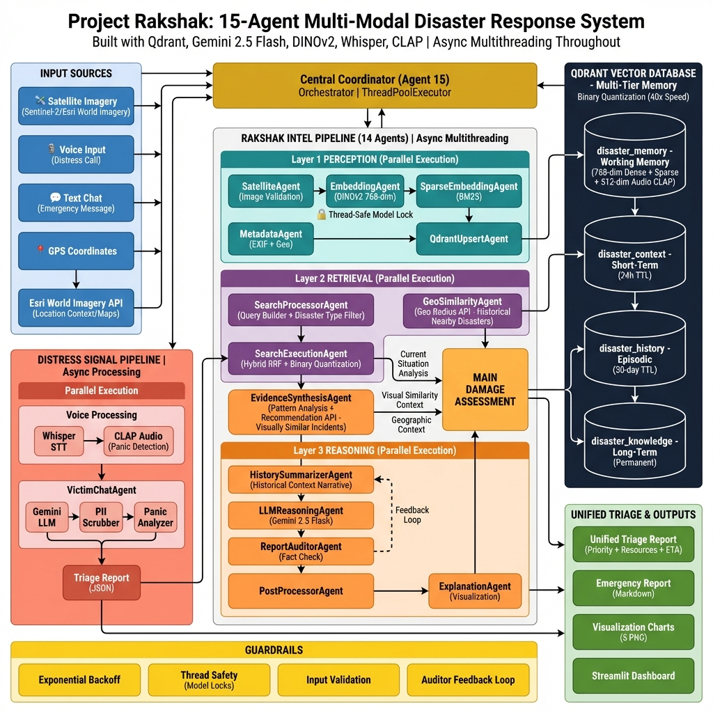

# System Architecture

The proposed platform is architected as a modular, multi-agent system intentionally decomposed into **three semantic layers** and **15 cooperating agents**. In addition, a parallel **Distress Signal Subsystem** operates alongside the main pipeline to incorporate real-time human inputs.

## High-Level Architecture Overview

At a high level, the system follows a layered design that separates perception, retrieval, and reasoning concerns.

*   **Layer 1 -- Perception and Ingestion:** Ingests satellite imagery, computes dense/sparse embeddings, parses metadata, and upserts into Qdrant.
*   **Layer 2 -- Retrieval and Search:** Handles intelligent query planning, hybrid multimodal retrieval (dense, sparse, metadata), and result validation.
*   **Layer 3 -- Reasoning and Post-Processing:** Synthesizes evidence, performs multi-stage LLM reasoning, calibrates confidence, and produces triage recommendations.
*   **Central Coordinator:** The DAG orchestrator organizing agent execution and data flow that utilizes **multithreading** to manage data flow and parallel execution of the 15-agent pipeline.
*   **Memory Architecture:** Leverages Qdrant's disk-backed persistence (mmap/WAL) to maintain a durable "episodic memory" of 19+ disasters, ensuring resilience against restarts.
*   **Safety Mechanisms:** Incorporates a dedicated **Auditor Agent** to perform hallucination checks and ground-truth verification on all generated outputs before display.

### Distress Signal Subsystem
A dedicated subsystem processes live victim chat and voice inputs. This subsystem captures geolocation, textual, and acoustic signals; performs geo-aware fast-path risk checks; interacts with victims through a Gemini-based emergency persona; and extracts structured triage signals.

---

## Agent Breakdown

The platform is architected as a set of 15 cooperating agents across three layers:

### Layer 1 -- Perception and Ingestion
*   **SatelliteAgent:** Preprocesses raw imagery and synthesizes standardized Areas-of-Interest (AOI) for consistent analysis.
*   **EmbeddingAgent:** Encodes visual features using a **DINOv2 ViT-B/14** foundation model to produce 768-dimensional dense vectors.
*   **SparseEmbeddingAgent:** Tokenizes metadata into **BM25-weighted sparse vectors**, enabling precise keyword-based retrieval.
*   **AudioIngestionAgent:** Transcribes emergency calls via **Whisper** and computes **CLAP embeddings** for audio panic analysis.
*   **MetadataAgent:** Parses JSON labels to extract structured disaster metrics (damage counts, sensor consistency).
*   **QdrantUpsertAgent:** Serializes multimodal data (Dense+Sparse+Payload) and commits it to the `disaster_memory` collection, ensuring robust data persistence via mmap/WAL to survive system restarts (Memory).

### Layer 2 -- Retrieval and Search
*   **SearchProcessorAgent:** Constructs optimized hybrid queries and applies cross-disaster transfer penalties to filter irrelevant domains.
*   **SearchExecutionAgent:** Executes parallel multimodal retrieval, fusing results via **Reciprocal Rank Fusion (RRF)** for stable ranking.

### Layer 3 -- Reasoning and Post-Processing
*   **EvidenceSynthesisAgent:** Aggregates damage patterns and expands retrieval scope using Qdrant's **Recommendation API**.
*   **GeoSimilarityAgent:** Performs fast **Geo-Radius** filtering to identify and retrieve spatially proximal historical precedents.
*   **HistorySummarizerAgent:** Synthesizes retrieved incident reports into a coherent, evidence-backed historical narrative.
*   **LLMReasoningAgent:** Orchestrates the **Gemini 2.5 Flash** model to generate the primary damage assessment and triage draft.
*   **ReportAuditorAgent:** Self-critiques the draft report against ground-truth evidence to detect and correct hallucinations (Safety). This verification layer ensures that the system's output is factually accurate and safe for operational decision-making.
*   **PostProcessorAgent:** Calibrates final confidence scores using ensemble consistency and generates severity visualizations.

### Distress Subsystem
*   **VictimChatAgent:** Manages real-time emergency communication, using **Whisper** for transcription and **CLAP** for panic level detection.

### Coordinator
*   **CentralCoordinator:** The DAG orchestrator that utilizes **multithreading** to manage data flow and parallel execution of the 15-agent pipeline.

---

## Why Qdrant?

### Native Multimodal Vector Support
The primary collection, `disaster_memory`, leverages Qdrant's **Named Vectors** capability to store heterogeneous representations within a single point (Dense Image + Sparse Text + Audio). This enables tight fusion without external score normalization.

### Hybrid Search with Server-Side Fusion
We use multiple **Prefetch** queries fused via **Reciprocal Rank Fusion (RRF)**, avoiding brittle application-layer normalization and yielding stable rankings.

### Binary Quantization for Scale
We explicitly enable **Binary Quantization** on the image vector, offering ~40x faster search and ~32x reduction in RAM. By compressing high-dimensional floating-point vectors into compact binary strings, we achieve sub-millisecond retrieval speeds even effectively on CPU-bound edge devices. We use **Oversampling and Rescoring** to recover precision, ensuring that the speed advantage does not come at the cost of retrieval accuracy.

### Rich Payload Schema and Geospatial Indexing
Qdrant's payload system enables fast **geo-radius filtering** for regional priors and response safety zones. By indexing geospatial coordinates alongside vector embeddings, we can effectively filter for the *historical context* of disasters that have occurred in the nearby region. This allows the system to prioritize locally relevant data, such as past flood patterns or seismic activity history in the user's vicinity, significantly improving the relevance of the threat assessment.

### Recommendation API
We invoke Qdrant's **Recommendation API** to perform "more-like-these" expansion over top-confidence incidents, reducing query drift. This is crucial for visual data; checking for *visually similar* disaster imagery efficiently allows the system to rapidly identify common structural damage patterns or environmental changes across different events without needing massive labeled datasets.

### Long-Term Persistent Episodic Memory
Project Rakshak employs Qdrant as a **long-term persistent episodic memory** to store and manage historical disaster events in a durable and scalable manner. Unlike transient, in-memory indexing mechanisms, the system relies on **disk-backed persistence**—enabled through memory-mapped storage (`mmap`) and write-ahead logging (WAL)—to ensure the permanent retention of rich multimodal representations derived from over 19 major disaster scenarios.

This persistent memory layer enables the system to continuously ground real-time inference and decision-making in historical evidence. By leveraging previously observed catastrophe patterns, Project Rakshak enhances situational awareness and improves the effectiveness and reliability of future disaster response strategies.
